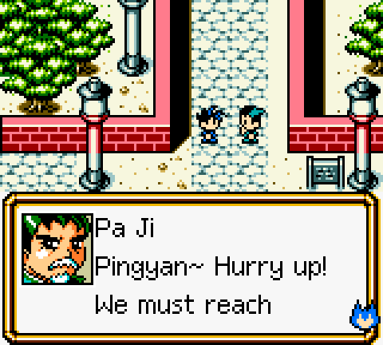
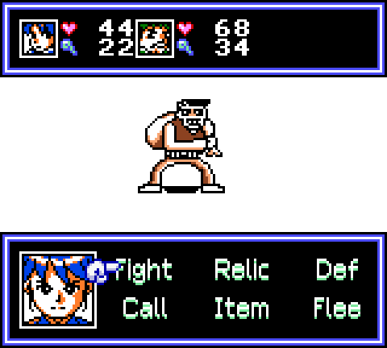
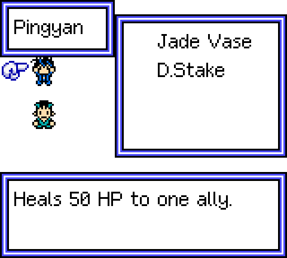
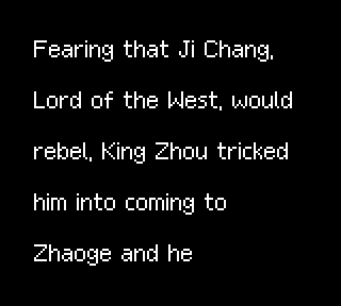
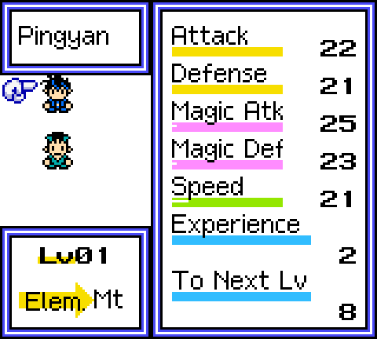
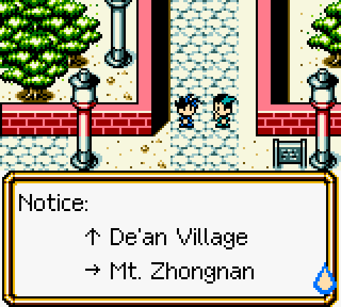

# Xin Feng Shen Bang: English translation of 新封神榜, Game Boy Color

> [!IMPORTANT]
> **This translation was made by AI.** The script, the reworked graphics and the code changes were produced by an
> AI model (Anthropic's Claude), directed by a human. No professional or fluent human translator reviewed it, and it
> hasn't been play-tested from start to finish, so expect mistakes, odd phrasing and the occasional bug.
>
> **If you enjoy fan translations, please support the humans who make them.** Play their releases, report bugs,
> credit them, contribute to their projects, and check whether a human translation of a game exists before reaching
> for an AI one. This patch is no substitute for their work.

**[Patch your ROM in the browser](https://gopherbone.github.io/XinFengShenBang_en/)**, or download the IPS patch
[`docs/xin-feng-shen-bang-en.ips`](docs/xin-feng-shen-bang-en.ips).

Xin Feng Shen Bang ("New Investiture of the Gods") is an unlicensed Taiwanese Game Boy Color RPG: a comedic
retelling of the classic *Investiture of the Gods* legend. Lazy, wisecracking Ji Pingyan, a distant descendant of
King Wu of Zhou, gets dragged into the war between Zhou and Shang alongside Nezha, Yang Jian, Leizhenzi and the rest
of the cast. This patch translates it into English.

More in [`docs/screenshots/`](docs/screenshots/).

## What's translated

- All dialogue (about 4,000 messages) and every signpost, drawn with a new proportional, mixed-case English
  font with automatic word wrap and pagination.
- Item, relic (法寶) and summon-beast names and descriptions, enemy names, battle messages, location names, the
  shop and Yes/No choices, the save screen and the opening prologue.
- Pre-drawn graphics: the field menu, Silver counter, status, item, equipment and party screens, the battle
  command menu, the signpost header and the title screen's New Game option.
- Character names are romanized (Ji Pingyan, Yin Wen, Ji Xiaojun, Jiang Ziya, Nezha, Yang Jian…), and places use
  pinyin plus an English word (Mt. Kunlun, Chentang Pass, Mengxiang). See [`script/glossary.md`](script/glossary.md).

## The ROM you need

This patch doesn't include the game. Use your own copy of:

| | |
|---|---|
| File name | `Xin Feng Shen Bang (Unlicensed, Chinese) (Multicart Rip) [Header Fix].gbc` |
| Size | 2,097,152 bytes (2 MiB) |
| CRC32 | `8C66647D` |
| MD5 | `bac4383b8c96c4e6051075d3c0d6fd75` |
| SHA-1 | `78ad577c4bb2791646186b7c197ffb678e856a90` |
| Header title | `SHAWU STORY` |

The patch expands the ROM to 4 MiB. The patched ROM has CRC32 `A4776DA7`
(SHA-1 `0fa4780055f4112031be675848d5ea251b3ede29`). Both header checksums are valid.

## How to patch

- **In the browser:** open the [web patcher](https://gopherbone.github.io/XinFengShenBang_en/) and drop your ROM
  on it. It checks the ROM, patches it locally (nothing is uploaded) and gives you the patched file.
- **With an IPS patcher:** apply [`docs/xin-feng-shen-bang-en.ips`](docs/xin-feng-shen-bang-en.ips) to the ROM
  above with Floating IPS, Lunar IPS, Rom Patcher JS or similar.

Play it on a Game Boy Color emulator (SameBoy, mGBA, Gambatte…) or on hardware with a flash cart that supports
4 MiB MBC5 ROMs.

## Known issues

- This is an AI translation; phrasing may be off in places. Corrections are welcome as issues or pull requests.
- The Chinese script was decoded from the game's own font bitmaps, which were transcribed by eye. A few rare
  characters may be misread, so some lines are translated from context.
- Only the start of the game, the menus, a battle and a sample of signs and shop prompts were checked on screen.
  Later lines were only checked by the build (that they fit and wrap), not seen in play.
- Some menu slots are tiny, so labels and a few relic and beast names are abbreviated ("Stat", "Def", "Call" for
  Summon, "D.Stake").
- Left in Chinese because they're artwork: the 新封神榜 title logo, the large calligraphy name cards in the intro and
  the 廣譽科技 publisher credit.
- A small set of four-character strings in bank `$0A` uses its own tiny character set and is untranslated; it's
  unclear where (or whether) they appear.

## Building from source

You need Python 3 and [RGBDS](https://rgbds.gbdev.io/) (`rgbasm`, `rgblink`, `rgbfix`) on your `PATH`.

1. Put the original ROM (hashes above) at `orig/xfsb.gbc`. The `orig/` folder is git-ignored; the ROM is never
   committed.
2. `python3 tools/build.py` writes `build/XinFengShenBang_en.gbc`, `docs/xin-feng-shen-bang-en.ips` and its hash
   file.

## How it works

- The ROM is expanded from 2 MiB to 4 MiB (MBC5). New banks carry the game's bank self-ID byte at `$7FFF`.
- `src/main.asm` hooks the game's three text engines in bank 0: dialogue (`$1C96` loop), the menu/battle
  interpreter (`$08CA`) and the location banner (bank `$0D`). Each looks the original `bank:address` up in a redirect
  table (banks `$81-$82`) and, if there's an English version, reads it from banks `$83+` instead. Untranslated text
  still goes through the original 16×16 Chinese renderer.
- The variable-width renderer (bank `$80`) draws 1bpp glyphs into a two-cell WRAM buffer and uploads them with the
  game's own HBlank-safe copier, reusing the original 16×16 cell layout of each text box. Shorter English strings
  blank the rest of their original slot.
- `tools/build.py` compiles `font/font.txt`, assembles the hacks, word-wraps and paginates the script by pixel width
  (`tools/script.py`), packs it into the new banks, redraws the graphic labels (`tools/labels.py`,
  `gfx/labels.json`), fixes the checksums and writes the IPS patch.

## Project layout

| Path | Contents |
|---|---|
| `src/` | ROM hooks and the variable-width text engine (RGBDS assembly) |
| `font/font.txt` | The English font, one ASCII-art glyph per character (original design) |
| `script/dialogue/` | English dialogue and signposts, keyed by original `bank:address` |
| `script/menu/` | English menu, item, battle and location strings, and the prologue |
| `script/names_en.txt` | Speaker names (index = original name-table index) |
| `script/glossary.md` | Translation glossary |
| `gfx/labels.json` | Graphic labels to redraw (ROM offset, tile layout, text, style) |
| `tools/` | Builder, script parsers, label redrawer, width checker, IPS maker |
| `tools/glyph_table.json` | Transcription of the original 2,189-glyph Chinese font |
| `docs/` | GitHub Pages site: web patcher, IPS patch, screenshots |

## Legal

This is an unofficial fan translation, not affiliated with the game's developer or publisher. Only a patch is
distributed; no game code or ROM is included.
